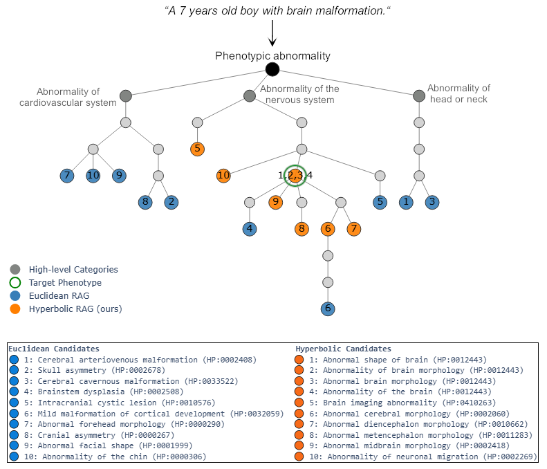
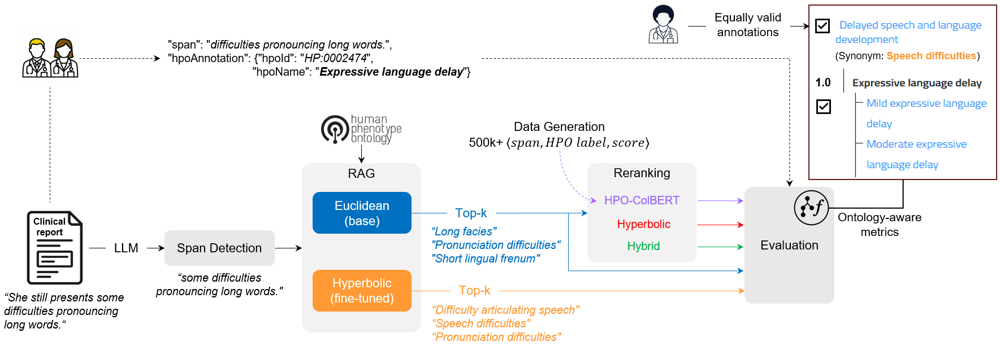

# Hierarchy-Aware Hyperbolic and Semantic Reranking for Ontology-Based Phenotype Linking

## Overview

HyperRAG is a novel pipeline for extracting and linking entities referenced in ontologies from unstructured text.
The current implementation covers clinical reports from which phenotypes should be extracted to enhance diagnosis.

It integrates Large Language Models (LLMs) for span detection, Retrieval-Augmented Generation (RAG) for candidate retrieval, and hierarchical reranking using hyperbolic embeddings trained on the Human Phenotype Ontology (HPO). 

The system is designed to capture both explicit and implicit phenotype mentions, leveraging the hierarchical structure of biomedical ontologies for improved accuracy and clinical relevance.



## Features

- **LLM-based Span Detection:** Identifies explicit and implicit phenotype mentions in clinical text.
- **RAG with Euclidean and Hyperbolic Embeddings:** Retrieves candidate phenotypes using dense vector similarity.
- **Hierarchical Reranking:** Reranks candidates using hyperbolic distances, hybrid approach or alternative baselines such as late-interaction fine-tuned models.
- **Ontology-Aware Evaluation:** Introduces new metrics that account for hierarchical relationships in HPO.
- **Reproducible Data Generation:** All training and evaluation datasets, as well as prompts, are provided for reproducibility.

## Workflow



The pipeline consists of four main steps:

1. **Span Detection:** Use a pretrained LLM (e.g., ChatGPT-3.5) to identify phenotype spans in clinical text.
2. **Candidate Retrieval (RAG):** Compute dense embeddings for spans and retrieve top-k phenotype candidates from HPO using Euclidean or hyperbolic similarity.
3. **Reranking:** Apply reranking strategy (e.g., euclidean, hyperbolic, hybrid, late-interaction)to refine candidates ranking.
4. **Evaluation:** Assess performance using both standard and hierarchy-aware metrics.

## Installation

### Requirements:

- [Python 3.11+](https://python.org/)
- [PyTorch](https://pytorch.org/)  
- [HuggingFace Transformers](https://huggingface.co/docs/transformers/index)
- [HierarchyTransformers](https://github.com/KRR-Oxford/HierarchyTransformers)
- [FAISS](https://github.com/facebookresearch/faiss)
- [ColBERTv2](https://github.com/stanford-futuredata/ColBERT)
- [DeepOnto](https://github.com/krr-oxford/DeepOnto) 
- Additional dependencies in `requirements.txt`


### Setup:

```
git clone https://github.com/xxx/hyperrag.git
cd hyperrag
pip install -r requirements.txt
```

## Data

### Ontologies

- **Human Phenotype Ontology (HPO):** Used for hierarchical embeddings and candidate retrieval. 2024/12/12 version.
- **SNOMED CT:** Used for comparative experiments with a general-purpose medical ontology.


### Training Data

- **Hyperbolic Embeddings:** Trained on HPO using triplets ⟨child, parent, label⟩, with synonym augmentation and negative sampling.
- **Late-Interaction Model:** Fine-tuned on synthetic clinical sentences generated for each HPO term using LLMs, with clinician-verified span extraction and quality filtering.

### Evaluation Data

- **ID-68:** Public benchmark dataset for phenotype extraction.
- **CHU-50:** Internal dataset of 50 anonymized clinical notes from Rennes Hospital, with 971 phenotype annotations (30% implicit).

All datasets and generation scripts are available in the data/ and src/ directories. 
Data and scripts used to fine-tune the hyperbolic embeddings based on Hierarchical Transformers are available in /HT_scripts.

## Getting started

### Configuration

The configuration file (`config.py`) references the usefull paths, the backend files and models used in the scripts, as well as the target configuration.

| Variable         | Description                                                                                                                                                                                                                                                       | Values                                                                                |
|------------------|-------------------------------------------------------------------------------------------------------------------------------------------------------------------------------------------------------------------------------------------------------------------|---------------------------------------------------------------------------------------|
| `target_dataset`   |                                                                                                                                                                                                                                                                   | `id-68`, `chu50`                                                                          |
| `top_k`            |                                                                                                                                                                                                                                                                   | Integer (default = 50)                                                                |
| `mips`             | Type of Maximum Inner Product Search (MIPS) used for candidate retrieval in hyperbolic embedding space | `hyp-knn` (currently only hyperbolic distances supported)                                                                             |
| `euclidean_model`  | Full name of the target euclidean model                                                                                                                                                                                                                           | e.g., `all-MiniLM-L12-v2`, `abhinand/MedEmbed-small-v0.1`, ...                                   |
| `hyperbolic_model` | Full name of the target hyperbolic model                                                                                                                                                                                                                          | e.g., `HiT-all-MiniLM-L12-v2-hpo-hpo_datasets_multi_random`, `iT-MiniLM-L12-SnomedCT-Hard` |
| `euc_mod`          | Euclidean model alias                                                                                                                                                                                                                                             | `base`, `med`                                                                             |
| `hyp_mod`          | Hyperbolic model alias                                                                                                                                                                                                                                            | `syn`, `no-syn`, `snomed`                                                                   |

Aliases are used for practical filename management. Below is the mapping between full model names and aliases:

| Model                                                                 | Alias  | Description                                                                                  |
|-----------------------------------------------------------------------|--------|----------------------------------------------------------------------------------------------|
| `all-MiniLM-L12-v2`                                                   | `base` | Base Euclidean model from which HPO and SNOMED hyperbolic models were fine-tuned             |
| `abhinand/MedEmbed-small-v0.1`                                        | `med`  | Pretrained medical Euclidean model                                                          |
| `HiT-all-MiniLM-L12-v2-hpo-hpo_datasets_syn_multi_random`             | `syn`  | Fine-tuned HPO hyperbolic model with synonyms                                               |
| `HiT-all-MiniLM-L12-v2-hpo-hpo_datasets_no-syn_multi_random`          | `no-syn` | Fine-tuned HPO hyperbolic model without synonyms                                            |
| `HiT-MiniLM-L12-SnomedCT-Hard`                                        | `snomed` | Pretrained SNOMED hyperbolic model                                                          |


### Span Detection

Detect phenotype spans in clinical text using the provided LLM prompt (see `prompts/span_detection.txt`).

```bash
python src/spans_detection.py
```

### Retrieval-Augmented Generation

Retrieve candidate phenotypes using Euclidean or hyperbolic embeddings.

```bash
python src/rag.py
```

### Reranking

Rerank candidates using different strategies including Euclidean, hyperbolic, hybrid, and late-interaction models.

```bash
python src/reranking.py
```

### Evaluation

Evaluate using both standard and hierarchy-aware metrics that consider ontology structure.

```bash
python src/evaluation.py
```

### Running the Full Pipeline

To run the entire HyperRAG pipeline end-to-end, use the master script located at the root of the repository:

```bash
python run_hyperrag.py
```

This script executes all steps sequentially and provides progress information and error handling.


## Reproducibility

- Prompts: All LLM prompts used for data generation and evaluation are provided in `prompts/`.
- Data Generation: Scripts for generating synthetic sentences, extracting spans, and filtering are in `src/data_generation/`.
- Model Training: Training scripts and hyperparameters for ColBERTv2 fine-tuning are in `src/late_interaction_training.py`, while hyperbolic training follows method from [HierarchyTransformers](https://github.com/KRR-Oxford/HierarchyTransformers).
- Evaluation: Scripts for both standard and ontology-aware evaluation are in `src/evaluation.py`.
- All datasets and models used in the paper are released for reproducibility.

## Results

Key findings from our experiments:

- Hybrid reranking (combining Euclidean and hyperbolic signals) achieves state-of-the-art recall and ranking accuracy, especially for implicit phenotype mentions.
- Hierarchy-aware metrics provide a more nuanced and clinically relevant assessment than exact string matching.
- Hyperbolic embeddings improve the capture of hierarchical relationships, leading to better candidate ranking at higher recall thresholds.

For detailed results and analysis, please refer to our paper:

*Anonymous. "HyperRAG: Hierarchy-Aware Retrieval-Augmented Generation with Hyperbolic Embeddings for Ontology-Based Entity Linking." 2025.*

## References

Please cite our work if you use this code or data:

```
@inproceedings{anonymous2025hyperrag,
  title={HyperRAG: Hierarchy-Aware Retrieval-Augmented Generation with Hyperbolic Embeddings for Ontology-Based Entity Linking},
  author={Anonymous},
  booktitle={},
  year={2025}
}
```

## Authors and Contributors

- **Project Lead:** Anonymous
- **Main Author:** Anonymous
- **Contributors:** Anonymous


## Acknowledgment

- Funding and computational resources: **Anonymous**
- Clinical data and annotation support: **Anonymous**


## License
Apache 2.0

